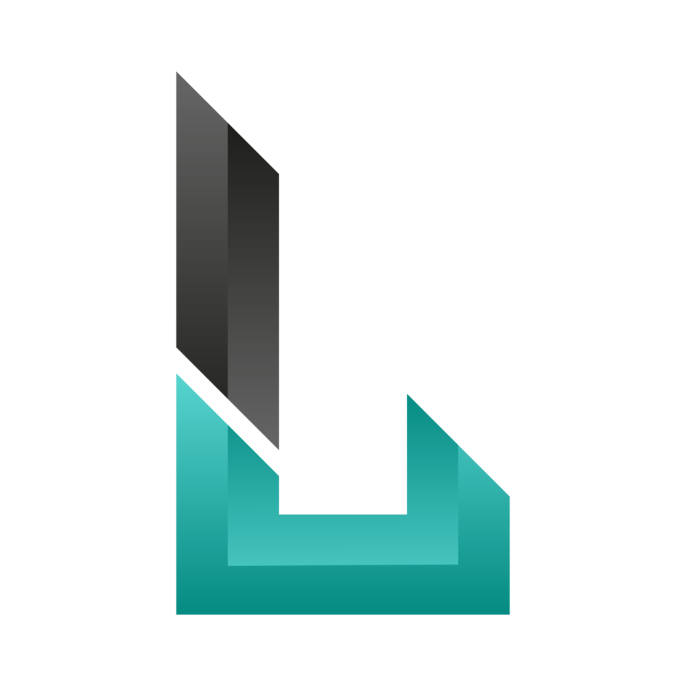
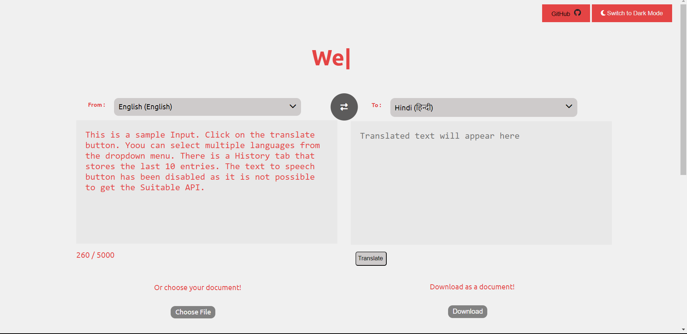

# LingoMate


## Project setup

### 1. Clone the Repository

```bash
git clone https://github.com/VineetMittal007/LingoMate.git

```
### 2. Navigate to the Project Directory
```
cd LingoMate
```

### 3.  Install Dependencies
Run the following command to install all the necessary dependencies:
```
yarn install
```
or 
```
npm install
```
### 4. Run the Development Server
To start the Vue.js development server locally:
```
yarn run
```
or 
```
npm run serve
```
After this, open http://localhost:8080 in your browser to see the project running.


## Screenshots




### Customize configuration
See [Configuration Reference](https://cli.vuejs.org/config/).


## Support

For support or suggestions, email vineetmittalxvnm@gmail.com  .

## Authors

- [@vineet_mittal](https://www.github.com/VineetMittal007)


